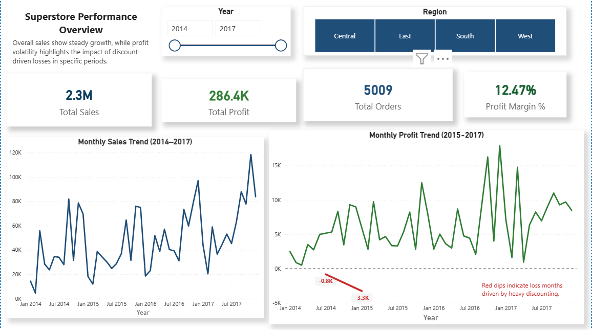
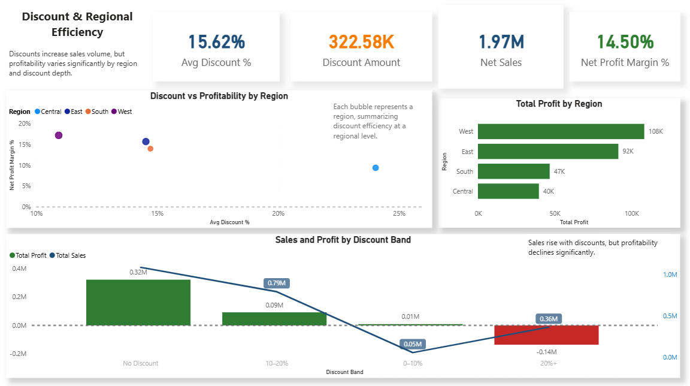
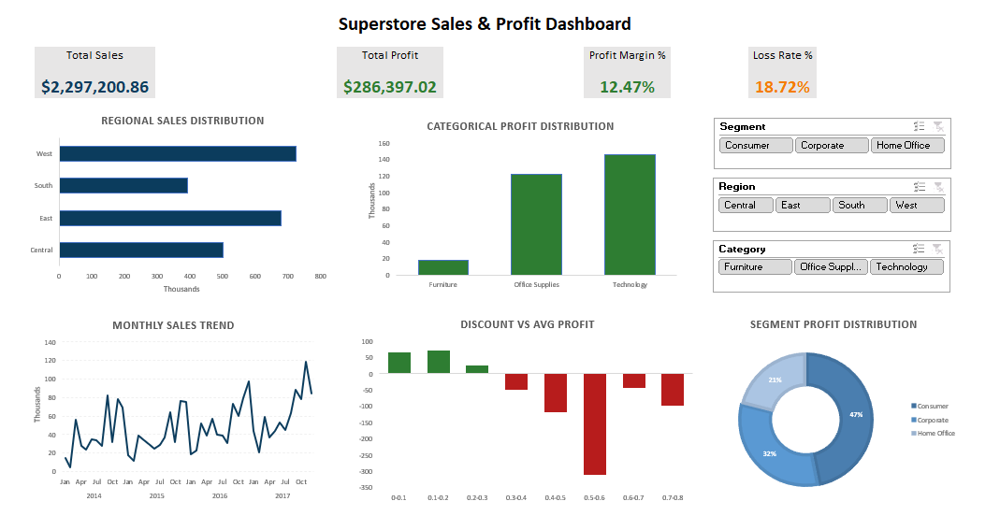

# 📊 Superstore End-to-End Business Intelligence & Analytics Project

## 📌 Project Summary

This project is a complete end-to-end Business Intelligence and Data Analytics pipeline built on the Superstore dataset.
The objective was to transform raw transactional sales data into structured business insights using SQL, Power BI, Python (statistical modeling), and Excel dashboards.

Pipeline Flow:
Raw Data → SQL Engineering → Business Metrics → Power BI Reporting → Statistical Modeling (Python) → Executive Excel Dashboard

---

## 🛠 Tech Stack
**MySQL** – Database setup, cleaning, transformation, KPI computation
**Power BI** – Multi-page interactive business dashboards
**Python (Pandas, NumPy, Matplotlib, Seaborn, SciPy, Statsmodels)** – Data validation, statistical inference, regression modeling, distribution analysis
**Excel** – Executive-level interactive dashboard using Pivot Tables and Slicers

---

## 📂 Project Structure
```
superstore_project/
│
├── sql/
│   ├── 01_database_setup.sql
│   ├── 02_data_load.sql
│   ├── 03_data_cleaning.sql
│   ├── 04_exploratory_analysis.sql
│   ├── 05_business_insights.sql
│
├── notebooks/
│   ├── 01_data_preparation.ipynb
│   ├── 02_eda_validation.ipynb
│   ├── 03_statistical_inferences.ipynb
│   ├── 04_regression_discount_model.ipynb
│   ├── 05_distribution_modeling.ipynb
│
├── powerbi/
│   └── superstore_dashboard.pbix
│
├── excel_dashboard/
│   └── superstore_dashboard.xlsx
│
├── data/
│   ├── superstore_clean.csv
│   ├── superstore_clean_data.csv
│   ├── superstore_enriched.csv
│
├── assets/
│   ├── powerbi_overview.png
│   ├── powerbi_discount.png
│   └── excel_dashboard.png
|
└── README.md

```

## 🗄 SQL Pipeline

### 01 Database Setup
- Created structured schema
- Defined appropriate data types
- Organized transactional data for analysis

### 02 Data Loading
- Imported raw Superstore dataset into MySQL
- Verified data consistency and structure

### 03 Data Cleaning & Feature Engineering
- Handled missing values
- Standardized categorical variables
- Calculated derived metrics:
  - Profit Margin
  - Loss Flag
  - Shipping Days
  - Discount Bands

### 04 Exploratory Analysis
- Regional sales performance
- Category-level profitability
- Segment contribution analysis
- Discount vs Profit impact exploration

### 05 Business Insights Queries
- Total Sales
- Total Profit
- Profit Margin %
- Loss Rate %
- Regional efficiency
-  Discount impact on profitability

--- 

## 📊 Power BI Dashboard (4 Pages)

### 01 Overview
- KPIs: Total Sales, Total Profit, Profit Margin %, Loss Rate %
- High-level performance summary

### 02 Product & Category Performance
- Category profitability comparison
- Product-level contribution analysis

### 03 Customer & Segment Analysis
- Segment-wise profit distribution
- Customer performance insights

### 04 Discount & Regional Efficiency
- Discount impact on average profit
- Regional performance benchmarking

---

## 📸 Dashboard Preview

### 🔹 Power BI – Overview


### 🔹 Power BI – Discount & Regional Efficiency


### 🔹 Excel Executive Dashboard


--- 

## 🧪 Python Analytical Modeling

### 01️ Data Preparation
- Loaded SQL-cleaned dataset
- Validated structure and feature consistency
- Generated enriched dataset

### 02 EDA Validation
- Distribution checks
- Correlation analysis
- Trend validation

### 03 Statistical Inference
- Hypothesis testing
- Confidence intervals
- Variance analysis across categories

### 04️ Regression Modeling – Discount Impact
- Built linear regression model
- Measured impact of discount on profit
- Identified negative elasticity zones

### 05 Distribution Modeling
- Fitted statistical distributions to profit data
- Evaluated skewness and tail behavior
- Compared goodness-of-fit

--- 

##  📈 Excel Executive Dashboard

Created a dynamic executive-level dashboard using Pivot Tables and Slicers featuring:

### KPIs
- Total Sales
- Total Profit
- Profit Margin %
- Loss Rate %

### Visual Insights
- Regional Sales Distribution
- Category Profit Distribution
- Monthly Sales Trend
- Discount vs Average Profit
- Segment Profit Distribution (Donut Chart)

### Interactivity
- Slicers for:
  - Region
  - Segment
  - Category

--- 

## 🔍 Key Business Findings
- Higher discount bands significantly reduce average profit.
- Technology category drives the highest overall profitability.
- Loss rate indicates substantial exposure in discounted segments.
- Profit distribution exhibits skewness with heavy negative tails.
- Regional performance varies in both revenue and efficiency.

--- 

## 🎯 Skills Demonstrated
- End-to-end data pipeline development
- SQL-based data engineering & KPI creation
- Business intelligence dashboard design
- Statistical modeling & regression analysis
- Distribution fitting & inference
- Multi-tool workflow integration
- Business storytelling with data

--- 

## 🚀 Project Objective
- This project demonstrates the ability to:
- Transform raw data into structured business insights
- Combine SQL, BI tools, and statistical modeling
- Communicate analytical findings effectively
- Build production-style folder architecture
- Deliver executive-ready dashboards

---

## 👩‍💻 Author

**Heena Pillania**  
MSc Mathematics (IIT Hyderabad) | Data Analytics | Business Intelligence | Statistical Modeling  

📧 Email: heenapillania82@gmail.com  
🔗 LinkedIn: https://www.linkedin.com/in/heenapillania  
🔗 GitHub: https://github.com/heenapillania  

---

*Open to Data Analytics, Business Intelligence, and Data Science internship opportunities.*
